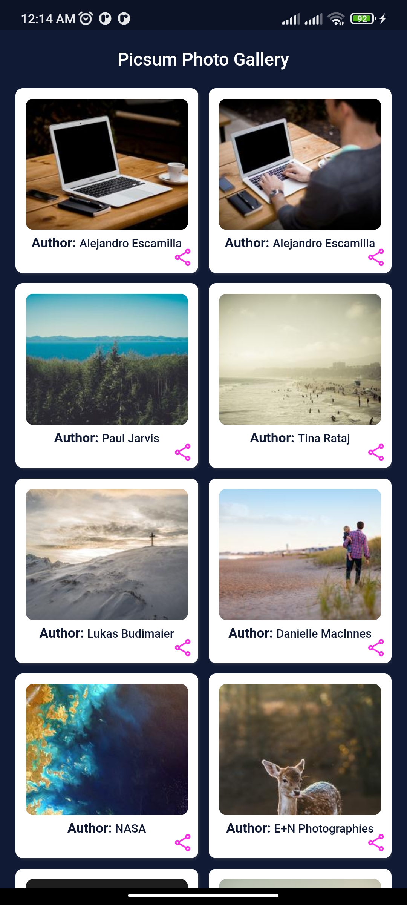
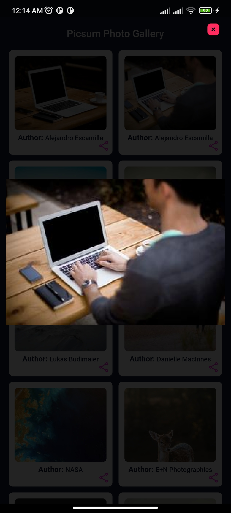

# flutter_gallery

<b>--</b> A Gallery app, named "Picsum Photo Gallery". It made with Flutter with the Google's Bloc design pattern. 
To view the image gallery, I took the Picsum.photos free image list api.
- [Picsum.photos Free API Link](https://picsum.photos/v2/list)

App Screenshots-
- [Home Screen](assets/images/home.jpg)

- [Image View Screen](assets/images/after_image_tap.jpg)

